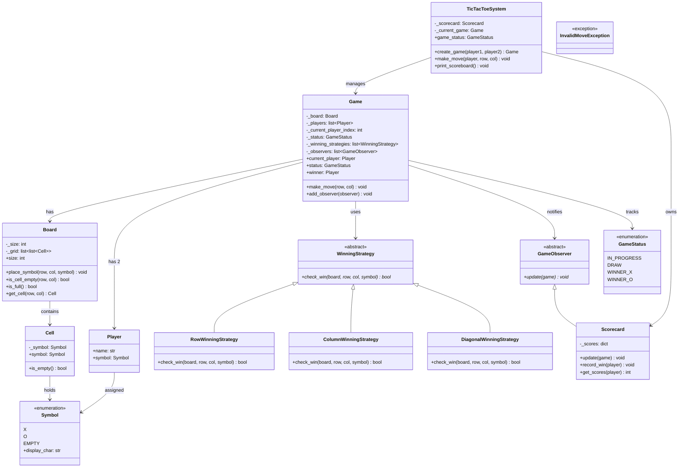
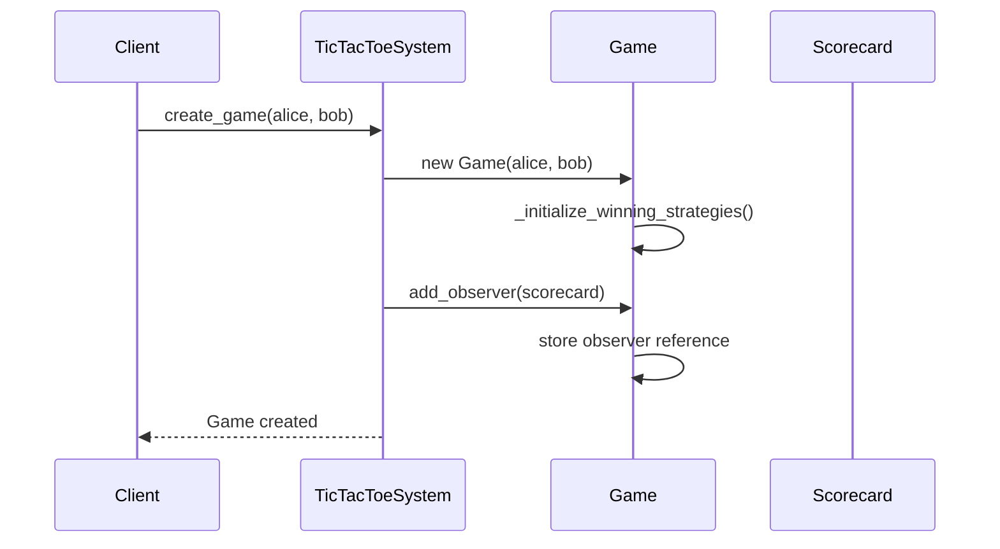
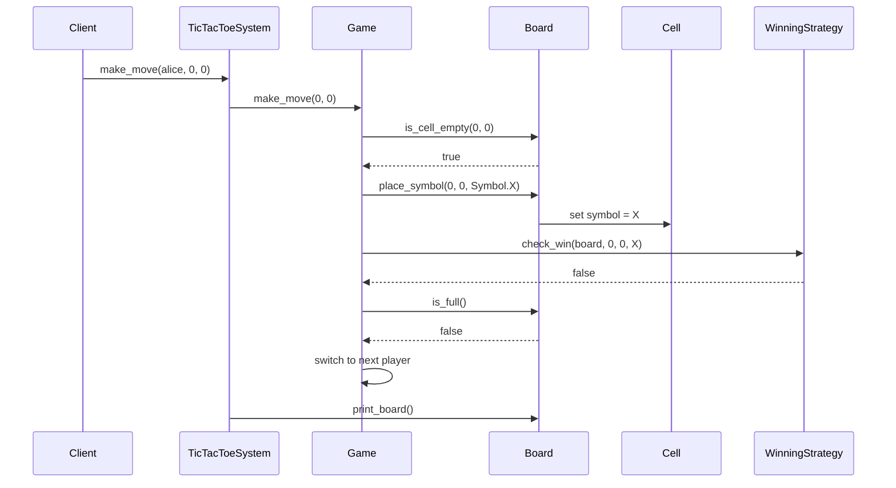
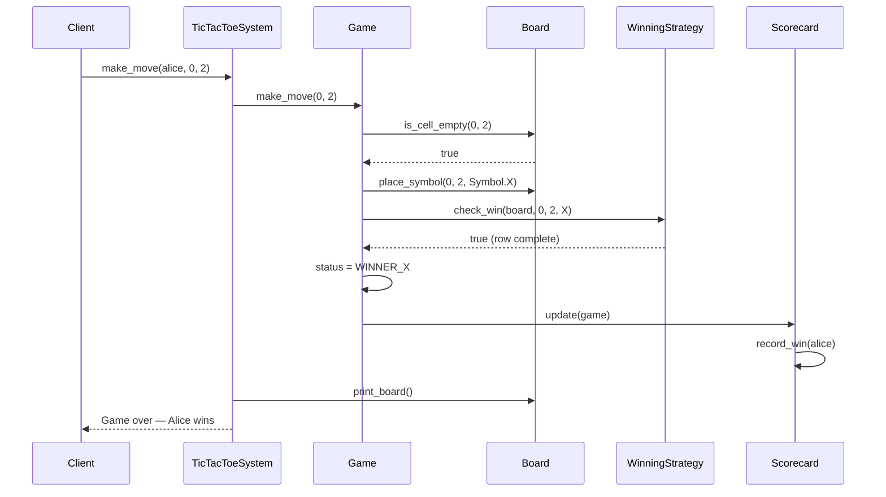
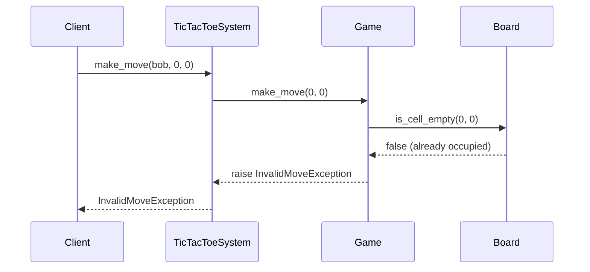

# Tic Tac Toe — Low-Level Design

A cleanly architected, object-oriented Tic Tac Toe game built in Python, demonstrating several core design patterns: Strategy, Observer, and Singleton.

## Overview

This project models a two-player Tic Tac Toe system where players take turns placing symbols on a 3×3 board. The design emphasizes separation of concerns, extensibility, and thread safety.

## Project Structure

```
design_tic_tac_toe/
├── main.py                         # Entry point
├── core/
│   ├── board.py                    # Board grid management
│   ├── game.py                     # Game orchestration and turn logic
│   └── tic_tac_toe_system.py       # Singleton system facade
├── entities/
│   ├── cell.py                     # Individual board cell
│   └── player.py                   # Player dataclass
├── enums/
│   ├── symbol.py                   # X, O, EMPTY symbols
│   └── game_status.py              # IN_PROGRESS, DRAW, WINNER_X, WINNER_O
├── strategy/
│   ├── winning_strategy.py         # Abstract strategy interface
│   ├── row_winning_strategy.py     # Row win check
│   ├── column_winning_strategy.py  # Column win check
│   └── diagonal_winning_strategy.py# Diagonal win check
├── observer/
│   ├── game_observer.py            # Abstract observer interface
│   └── scorecard.py                # Tracks wins per player
└── exceptions/
    └── invalid_move_exception.py   # Custom exception for invalid moves
```

## Design Patterns Used

**Strategy Pattern** — Win detection is decoupled from the `Game` class. Each win condition (row, column, diagonal) is encapsulated in its own strategy class implementing `WinningStrategy`. Adding new win conditions (e.g., for larger boards or custom rules) requires no changes to `Game`.

**Observer Pattern** — The `Scorecard` observes the `Game` and automatically updates scores when a game ends with a winner. New observers (e.g., logging, analytics, replay recording) can be added without modifying game logic.

**Singleton Pattern** — `TicTacToeSystem` uses a thread-safe singleton to ensure a single game management entry point across the application.

## Class Diagram



## Sequence Diagrams

### 1. Game Creation



### 2. Making a Move (No Win)



### 3. Making a Winning Move



### 4. Invalid Move Handling



## How to Run

```bash
cd design_tic_tac_toe
python main.py
```

## Key Design Decisions

**Frozen dataclass for Player** — Players are immutable value objects. Once created with a name and symbol, they cannot be changed, which prevents accidental mutation during gameplay.

**Property with setter on Cell** — Unlike Player, cells are mutable by design since symbols are placed on them during the game. The `@property` pattern allows future validation in the setter without changing the public API.

**Thread safety** — Both `Game` and `Scorecard` use threading locks to protect shared mutable state, making the system safe for concurrent access scenarios.

**Strategy pattern for win detection** — Rather than hardcoding win checks in the Game class, each direction of win (row, column, diagonal) is a separate strategy. This makes it trivial to extend to larger boards or custom win conditions.